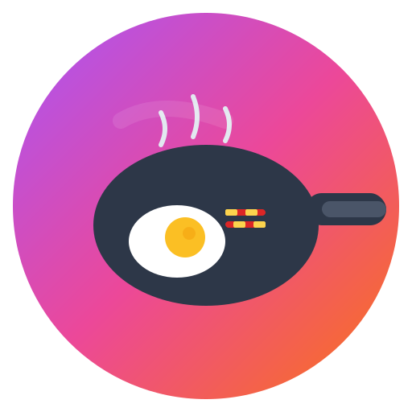

# 🍳 Recipe Explorer

A modern, elegant web application to discover delicious recipes by ingredients. Built with Next.js, TypeScript, and Tailwind CSS.



## ✨ Features

- **Ingredients Page** - Browse all ingredients with auto-categorized sections (Meat & Poultry, Seafood, Vegetables, Fruits, etc.)
- **Ingredient Detail Page** - View meals by selected ingredient with search functionality
- **Meal Detail Page** - Complete recipe with ingredients, instructions, and embedded YouTube video
- **Search** - Real-time search for ingredients and meals
- **Responsive Design** - Optimized for desktop, tablet, and mobile
- **Modern UI** - Elegant, light, minimalist design with colorful gradients

## 🛠️ Tech Stack

- **Framework:** [Next.js 16](https://nextjs.org/) (App Router)
- **Language:** [TypeScript](https://www.typescriptlang.org/)
- **Styling:** [Tailwind CSS v4](https://tailwindcss.com/)
- **API:** [TheMealDB](https://www.themealdb.com/api.php)

## 📁 Project Structure

```
src/
├── app/
│   ├── page.tsx                    # Ingredients list page
│   ├── layout.tsx                  # Root layout with header/footer
│   ├── ingredients/[name]/page.tsx # Meals by ingredient
│   └── meals/[id]/page.tsx         # Meal detail page
├── components/
│   ├── atoms/                      # Basic UI elements
│   │   ├── IngredientCard.tsx
│   │   ├── MealCard.tsx
│   │   ├── SearchInput.tsx
│   │   ├── LoadingSpinner.tsx
│   │   └── EmptyState.tsx
│   └── molecules/                  # Composite components
│       ├── IngredientsList.tsx
│       └── MealsList.tsx
├── lib/
│   ├── api.ts                      # API client
│   └── categories.ts               # Ingredient categorization
└── types/
    └── index.ts                    # TypeScript types
```

## 🚀 Getting Started

### Prerequisites

- Node.js 18+ 
- npm or yarn

### Installation

```bash
# Clone the repository
git clone https://github.com/dehyabi/cmlabs-frontend-parttime-test.git

# Navigate to project directory
cd cmlabs-frontend-parttime-test

# Install dependencies
npm install

# Run development server
npm run dev
```

Open [http://localhost:3000](http://localhost:3000) to view in browser.

### Build for Production

```bash
npm run build
npm start
```

## 📱 Pages

| Page | Route | Description |
|------|-------|-------------|
| Ingredients | `/` | Browse all ingredients organized by category |
| Ingredient Detail | `/ingredients/[name]` | Meals filtered by ingredient |
| Meal Detail | `/meals/[id]` | Full recipe with video |

## 🎨 Design

- **Color Palette:** Gradient colors (violet → pink → orange)
- **Typography:** Inter font family
- **Components:** Atomic design pattern (atoms/molecules)
- **Responsive:** Mobile-first approach with Tailwind breakpoints

## 📖 API Endpoints Used

| Endpoint | Description |
|----------|-------------|
| `list.php?i=list` | Get all ingredients |
| `filter.php?i={ingredient}` | Filter meals by ingredient |
| `search.php?s={name}` | Search meals by name |
| `lookup.php?i={id}` | Get meal details |

## 👤 Author

**Dehya Qalbi**
- GitHub: [@dehyabi](https://github.com/dehyabi)
- Email: dehyafullstack@gmail.com

## 📄 License

This project is open source and available under the [MIT License](LICENSE).

---

<p align="center">
  Made with ❤️ for cmlabs frontend test
</p>